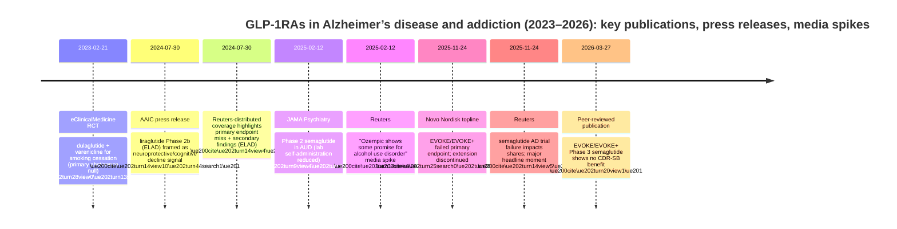

# GLP-1 Receptor Agonists in Alzheimer’s Disease and Alcohol/Substance Addiction: Phase 2–3 Clinical Evidence (2023–present)

## Executive summary

Across **Alzheimer’s disease (AD)** and **alcohol/substance addiction**, peer-reviewed Phase 2–3 clinical evidence since 2023 is **limited in count**, **heterogeneous in endpoints**, and **often less definitive than mainstream narratives imply**.

In **Alzheimer’s disease**, the evidentiary picture is now substantially clarified by two peer-reviewed programs:

The **Phase 3 EVOKE and EVOKE+ trials of oral semaglutide** in early symptomatic, amyloid-confirmed AD (total randomized **n=3,808**) showed **no statistically significant benefit on the primary clinical progression endpoint (CDR-SB change to week 104)** in either trial, with effect estimates close to zero (EVOKE: \u22120.08; EVOKE+: +0.10) and confidence intervals spanning clinically meaningful benefit and harm. \ue200cite\ue202turn20view1\ue201

The **Phase 2b ELAD trial of liraglutide** in mild-to-moderate AD without diabetes (**n=204**) was **negative on its primary biomarker endpoint** (FDG-PET cerebral glucose metabolism) but showed a **modest statistical signal** on one cognitive composite (ADAS-Exec) and exploratory MRI volume outcomes, while **CDR-SoB and ADCS-ADL were not improved**. \ue200cite\ue202turn9view1\ue202turn16view1\ue201

Overall, **large Phase 3 clinical outcomes data (semaglutide) are negative**, while the smaller Phase 2b liraglutide study provides **hypothesis-generating** signals on secondary/exploratory measures but not on its primary biomarker endpoint. \ue200cite\ue202turn20view1\ue202turn18view2\ue201

In **alcohol/substance addiction**, the **only clearly identified peer-reviewed randomized clinical trial in AUD (2023–present)** is a **small Phase 2 RCT (n=48)** of **once-weekly semaglutide** that found reductions in **laboratory alcohol self-administration** and some weekly outcomes (e.g., drinks per drinking day, craving) but **no improvement in several “real-world” consumption measures** (e.g., drinks per calendar day; drinking days). Safety signals were consistent with expected GLP-1RA effects and no serious AEs were reported in this small sample. \ue200cite\ue202turn9view4\ue202turn43view4\ue201

For **nicotine addiction (smoking cessation)**—a substance addiction indication—an investigator-initiated RCT (**n=255**) adding **dulaglutide** to high-intensity standard cessation therapy (varenicline + counseling) found **no benefit on the primary abstinence endpoint at 12 weeks**, despite metabolic benefits (less post-cessation weight gain; HbA1c improvement) and common GI symptoms. \ue200cite\ue202turn28view0\ue202turn29view0\ue201

**Media narratives** frequently generalize from (a) observational signals and anecdotes, or (b) secondary/exploratory endpoints, producing cycles of “promise” that are not consistently borne out by primary endpoints in large trials—especially in AD, where Phase 3 semaglutide ultimately showed no clinical slowing. \ue200cite\ue202turn14view4\ue202turn20view1\ue202turn44search2\ue201

## Scope and methods

This report covers **peer-reviewed Phase 2 and Phase 3 clinical trial results published from 2023 to present (as of 2026-04-04)** evaluating **GLP-1 receptor agonists (GLP-1RAs)** for two **non-weight-loss indications**:
- Alzheimer’s disease
- Alcohol/substance addiction (including nicotine dependence/smoking cessation as a substance addiction endpoint)

Priority was given to peer-reviewed articles and primary documentation (ClinicalTrials.gov entries, posted protocols, company announcements/press releases, and major media reports). Some publisher pages (notably certain Elsevier/Lancet hosting endpoints and some major media domains) were technically inaccessible in this environment at time of review; when key details were not obtainable from peer-reviewed sources, they are marked **“unspecified”** as requested.

Evidence strength labels used here:
- **Strong**: large randomized Phase 3 clinical outcomes with clear statistical conclusions on patient-relevant endpoints.
- **Preliminary**: small Phase 2 trials; reliance on surrogate endpoints, laboratory paradigms, or secondary/exploratory outcomes.
- **Overhyped risk**: when media/press framing implies broad clinical efficacy despite negative primary endpoints, limited sample sizes, or surrogate outcomes.

## Alzheimer’s disease

### Trial-level extraction and comparative table

Key links (papers, registry, announcements):

```text
EVOKE / EVOKE+ (peer-reviewed report via indexed abstract): https://ichgcp.net/clinical-trials-registry/publications/284485-efficacy-and-safety-of-oral-semaglutide-14-mg-flexible-dose-in-early-stage-symptomatic-alzheimer-s
EVOKE (ClinicalTrials.gov): https://clinicaltrials.gov/study/NCT04777396
EVOKE+ (ClinicalTrials.gov): https://clinicaltrials.gov/study/NCT04777409

ELAD (Nature Medicine): https://www.nature.com/articles/s41591-025-04106-7
ELAD Supplementary information (PDF): https://www.repository.cam.ac.uk/bitstreams/1db97df4-f096-454a-b8f7-35561c631623/download
ELAD (ClinicalTrials.gov): https://clinicaltrials.gov/study/NCT01843075
```

| Trial | Identifier | Phase | Drug (class) | Dose | Population | Sample size | Design | Duration / follow-up | Primary endpoint(s) | Primary result (effect size, CI, p) | Key secondary/exploratory findings | Subgroup analyses (reported) |
|---|---|---|---|---|---|---:|---|---|---|---|---|---|
| EVOKE | NCT04777396 \ue200cite\ue202turn20view1\ue202turn23search1\ue201 | Phase 3 \ue200cite\ue202turn20view1\ue201 | **Oral semaglutide** (GLP-1RA) \ue200cite\ue202turn20view1\ue201 | Up to **14 mg once daily** (flexible dose) \ue200cite\ue202turn20view1\ue201 | Amyloid-confirmed AD, age 55–85; MCI or mild dementia due to AD \ue200cite\ue202turn20view1\ue202turn23search1\ue201 | Randomized in EVOKE: **n=1,855** (semaglutide 928; placebo 927) \ue200cite\ue202turn20view1\ue201 | Multicenter, randomized, double-blind, placebo-controlled \ue200cite\ue202turn20view1\ue201 | Treated up to 156 weeks; **primary analysis at week 104** \ue200cite\ue202turn20view1\ue202turn23search1\ue201 | **Change in CDR-SB from baseline to week 104** \ue200cite\ue202turn20view1\ue201 | Mean change 2.3 vs 2.3; **\u0394 \u22120.08 (95% CI \u22120.35 to 0.20), p=0.57** \ue200cite\ue202turn20view1\ue201 | Not detailed in the accessible peer-reviewed abstract beyond primary endpoint and AE summary (**other endpoints unspecified**) \ue200cite\ue202turn20view1\ue201 | None reported in accessible peer-reviewed abstract (**unspecified**) \ue200cite\ue202turn20view1\ue201 |
| EVOKE+ | NCT04777409 \ue200cite\ue202turn20view1\ue202turn24search0\ue201 | Phase 3 \ue200cite\ue202turn20view1\ue201 | **Oral semaglutide** (GLP-1RA) \ue200cite\ue202turn20view1\ue201 | Up to **14 mg once daily** (flexible dose) \ue200cite\ue202turn20view1\ue201 | Similar to EVOKE; additionally included participants with “significant small vessel pathology” \ue200cite\ue202turn20view1\ue201 | Randomized in EVOKE+: **n=1,953** (semaglutide 976; placebo 977) \ue200cite\ue202turn20view1\ue201 | Multicenter, randomized, double-blind, placebo-controlled \ue200cite\ue202turn20view1\ue201 | Treated up to 156 weeks; **primary analysis at week 104** \ue200cite\ue202turn20view1\ue202turn24search0\ue201 | **Change in CDR-SB from baseline to week 104** \ue200cite\ue202turn20view1\ue201 | Mean change 2.2 vs 2.1; **\u0394 +0.10 (95% CI \u22120.17 to 0.38), p=0.46** \ue200cite\ue202turn20view1\ue201 | Baseline: mean age 72.2; baseline CDR-SB 3.7; only **54 participants (2.8%)** noted with small vessel pathology in EVOKE+ baseline description \ue200cite\ue202turn20view1\ue201 | Small vessel pathology subgroup not reported with outcomes in accessible abstract (**unspecified**) \ue200cite\ue202turn20view1\ue201 |
| ELAD | NCT01843075 \ue200cite\ue202turn9view1\ue202turn24search3\ue201 | Phase 2b \ue200cite\ue202turn9view1\ue201 | **Liraglutide** (GLP-1RA) \ue200cite\ue202turn9view1\ue201 | Daily injections (up to **1.8 mg** reported in secondary coverage; dose escalation specifics **unspecified in the extracted main-text lines**) \ue200cite\ue202turn7search5\ue202turn9view1\ue201 | Mild-to-moderate AD syndrome, **no diabetes** \ue200cite\ue202turn9view1\ue201 | **n=204** randomized (102/102); 169 completed \ue200cite\ue202turn9view1\ue201 | Multicenter, randomized, double-blind, placebo-controlled \ue200cite\ue202turn9view1\ue201 | **52 weeks** treatment; PET/MRI and neuropsychometric assessments at baseline and week 52 \ue200cite\ue202turn9view1\ue202turn16view1\ue201 | **Change in cerebral glucose metabolic rate (FDG-PET SUV)** \ue200cite\ue202turn9view1\ue202turn16view1\ue201 | **Adjusted \u0394 \u22120.17 (95% CI \u22120.39 to 0.06), p=0.14** \ue200cite\ue202turn9view1\ue202turn16view1\ue201 | **ADAS-Exec**: \u0394 **+0.15 (0.03 to 0.28), p=0.01**; **CDR-SoB**: \u0394 \u22120.06 (\u22120.57 to 0.44), p=0.81; **ADCS-ADL**: \u0394 \u22120.58 (\u22123.13 to 1.97), p=0.65. Exploratory MRI: lower temporal lobe and total gray matter volume loss, among other regions. \ue200cite\ue202turn16view1\ue202turn18view2\ue201 | No formal subgroup interaction results located in peer-reviewed text; baseline stratification by MMSE and CDR reported (counts) \ue200cite\ue202turn16view1\ue202turn9view1\ue201 |

### Efficacy synthesis and effect-size visualization


Interpretation:
- **Semaglutide Phase 3 (EVOKE/EVOKE+)** provides **strong negative evidence** on a clinically meaningful endpoint (CDR-SB). Effect estimates were near zero with non-significant p-values in both trials, indicating **no detectable slowing of clinical progression** at 104 weeks. \ue200cite\ue202turn20view1\ue201
- **Liraglutide Phase 2b (ELAD)** is **not supportive of efficacy on its primary biomarker endpoint** (FDG-PET). While ADAS-Exec improved statistically, clinically anchored endpoints (CDR-SoB, ADCS-ADL) did not. This pattern elevates the risk that positive findings reflect **secondary endpoint multiplicity** and/or **measurement variability** rather than a robust disease-modifying signal. \ue200cite\ue202turn16view1\ue202turn18view2\ue201

### Safety and adverse event rates

**Semaglutide (EVOKE/EVOKE+):**
- Treatment-emergent adverse events (TEAEs) were common: **91.2%** in semaglutide-exposed vs **84.8%** placebo (pooled numbers as reported in the peer-reviewed abstract). \ue200cite\ue202turn20view1\ue201
- Fatalities considered treatment-related: **1 semaglutide vs 4 placebo** (as judged by investigators). \ue200cite\ue202turn20view1\ue201
- Severity-stratified AE tables, discontinuation rates, and system-organ class breakdowns are **not present in the accessible peer-reviewed abstract** and are therefore **unspecified** here.

**Liraglutide (ELAD):**
- Total adverse events: **991 AEs** over 12 months; occurring in **87** placebo participants and **88** liraglutide participants (participant-level “any AE” \u224885–86%). \ue200cite\ue202turn18view1\ue201
- Serious adverse events: **17.6%** placebo (18 participants) vs **6.9%** liraglutide (7 participants); one life-threatening SAE occurred in placebo. \ue200cite\ue202turn18view1\ue201
- GI adverse events were prominent in liraglutide recipients (e.g., anorexia 25.2% vs 3.9%; constipation 12.6% vs 2.9%). \ue200cite\ue202turn16view1\ue202turn18view1\ue201


**Caution on comparability:** SAE reporting structures and follow-up differ substantially across trials; this figure is a descriptive cross-trial visualization of **reported** SAE rates, not a meta-analysis.

### Subgroup analyses

**EVOKE/EVOKE+:**
- EVOKE+ was designed to include small vessel pathology, but the peer-reviewed abstract reports only **54 participants (2.8%)** with small vessel pathology in EVOKE+ baseline description, limiting interpretability of any subgroup-based hypotheses without the full subgroup outcome tables. \ue200cite\ue202turn20view1\ue201
- Therefore, subgroup outcome effects are **unspecified** in peer-reviewed accessible data.

**ELAD:**
- The supplementary material reports baseline stratifications (e.g., MMSE ≤18 vs \u003e18; CDR categories) but does not provide an easily identifiable subgroup interaction analysis in the accessible sections. \ue200cite\ue202turn16view1\ue201
- Conclusion: subgroup efficacy evidence remains **preliminary/unspecified** from peer-reviewed accessible materials.

### Peer-reviewed evidence vs mainstream media vs corporate framing

**Media narratives and timing**
- At AAIC 2024, coverage highlighted that liraglutide “may protect against dementia” and suggested cognitive decline might be reduced (~18%)—a narrative amplified in conference press materials. \ue200cite\ue202turn14view10\ue202turn44search1\ue201  
- Reuters-distributed reporting about liraglutide emphasized that the trial **missed its primary endpoint** but “met secondary endpoints,” along with an eye-catching MRI atrophy framing. \ue200cite\ue202turn14view4\ue201  
- For semaglutide Phase 3 AD trials, Reuters framed the November 2025 topline failure as a blow to hopes of opening a major new market; this matched company topline messaging. \ue200cite\ue202turn14view5\ue202turn25search0\ue201

**Corporate pipeline projections / press releases**
- Novo Nordisk’s topline release stated EVOKE/EVOKE+ did **not** demonstrate a statistically significant reduction in AD progression on CDR-SB, and that any biomarker changes did not translate to clinical benefit; it also indicated the planned extension would be discontinued. \ue200cite\ue202turn25search0\ue202turn26search8\ue201
- A pre-results Reuters “high-stakes” narrative reported the trials were described internally as a “lottery ticket” and framed an expected success bar (e.g., ~20% reduction goal), which can contribute to pre-readout hype cycles. \ue200cite\ue202turn8search1\ue202turn8search6\ue201

**Where evidence appears strong vs preliminary vs overhyped**
- **Strong (negative):** Semaglutide EVOKE/EVOKE+ Phase 3 clinical endpoint data are definitive that **oral semaglutide (up to 14 mg) did not slow progression** by CDR-SB at 104 weeks. \ue200cite\ue202turn20view1\ue201  
- **Preliminary:** ELAD signals on ADAS-Exec and exploratory MRI volumes, in the setting of a **negative primary biomarker endpoint**, should be treated as hypothesis-generating. \ue200cite\ue202turn16view1\ue202turn18view2\ue201  
- **Overhype risk:** Headlines emphasizing “protects against dementia” or dramatic MRI atrophy reductions can obscure that the ELAD trial’s designated primary outcome was negative and that core clinical endpoints were not improved. \ue200cite\ue202turn14view4\ue202turn16view1\ue202turn44search1\ue201  

Key discrepancy drivers:
- **Primary vs secondary endpoints:** ELAD’s primary endpoint (FDG-PET metabolism) was negative, while selected secondary/exploratory endpoints showed signals—classic conditions for selective emphasis. \ue200cite\ue202turn16view1\ue202turn18view2\ue201  
- **Surrogate vs clinical outcomes:** FDG-PET and MRI volumes are biologically meaningful but do not directly equal patient-relevant cognitive/functional benefit; EVOKE used a clinical progression endpoint and was negative. \ue200cite\ue202turn16view1\ue202turn20view1\ue201  
- **Scale and statistical power:** Phase 2b studies may detect exploratory signals that don’t replicate; conversely Phase 3 power can still miss small effects, but EVOKE effect estimates were near zero. \ue200cite\ue202turn20view1\ue202turn9view1\ue201  

## Alcohol and substance addiction

### Trial-level extraction and comparative table

Key links (papers, registry, and major media coverage):

```text
Semaglutide for AUD (JAMA Psychiatry article page): https://jamanetwork.com/journals/jamapsychiatry/fullarticle/2829811
Semaglutide for AUD (PDF as accessed): https://tnsam.org/wp-content/uploads/2025/05/jamapsychiatry_hendershot_2025_oi_240094_1743461595.52316.pdf
ClinicalTrials.gov: NCT05520775 https://clinicaltrials.gov/study/NCT05520775

Dulaglutide for smoking cessation (peer-reviewed PDF): https://rcastoragev2.blob.core.windows.net/f4a34f44006850141b958f37a8c1b3db/main.PMC9981899.pdf
ClinicalTrials.gov: NCT03204396 https://clinicaltrials.gov/study/NCT03204396

Reuters coverage of semaglutide in AUD (hosted): https://www.investing.com/news/stock-market-news/ozempic-shows-some-promise-for-alcohol-use-disorder-3866141
TIME coverage: https://time.com/7221684/weight-loss-drug-ozempic-alcohol-addiction/
```

| Indication | Trial | Identifier | Phase | Drug | Dose | Population | Sample size | Design | Primary endpoint(s) | Primary result | Key secondary/exploratory outcomes | Subgroup analyses | Duration / follow-up |
|---|---|---|---|---|---|---|---:|---|---|---|---|---|---|
| Alcohol use disorder | Once-weekly semaglutide in adults with AUD | NCT05520775 \ue200cite\ue202turn9view4\ue202turn24search2\ue201 | Phase 2 \ue200cite\ue202turn9view4\ue201 | Semaglutide (GLP-1RA) \ue200cite\ue202turn9view4\ue201 | Dose escalated weekly; **primary post-treatment lab endpoint at 0.5 mg/week**; later escalation to 1.0 mg/week for some participants (non-endpoint) \ue200cite\ue202turn9view4\ue202turn43view2\ue201 | Adults with moderately severe AUD; non-treatment-seeking \ue200cite\ue202turn9view4\ue202turn43view4\ue201 | n=48 (24/24) \ue200cite\ue202turn9view4\ue202turn43view4\ue201 | Randomized, double-blind, placebo-controlled; hybrid human laboratory + outpatient \ue200cite\ue202turn9view4\ue201 | **Alcohol self-administration (grams consumed) in lab task** \ue200cite\ue202turn9view4\ue201 | **\u03b2 \u22120.48 (95% CI \u22120.85 to \u22120.11), p=0.01** for grams consumed; **\u03b2 \u22120.46 (\u22120.87 to \u22120.06), p=0.03** for peak BrAC \ue200cite\ue202turn9view4\ue202turn43view4\ue201 | Drinks per drinking day reduced: **\u03b2 \u22120.41 (\u22120.73 to \u22120.09), p=0.04**; weekly craving reduced: **\u03b2 \u22120.39 (\u22120.73 to \u22120.06), p=0.01**; no effect on drinks per calendar day or drinking days \ue200cite\ue202turn9view4\ue202turn43view4\ue201 | Smoking subsample: treatment-by-time predicted greater reduction in cigarettes/day: **\u03b2 \u22120.10 (\u22120.16 to \u22120.03), p=0.005** \ue200cite\ue202turn9view4\ue201 | Trial period ~9 weeks with weekly visits; follow-up beyond study end **unspecified** \ue200cite\ue202turn9view4\ue202turn24search2\ue201 |
| Nicotine addiction (smoking cessation) | Dulaglutide added to varenicline + counseling | NCT03204396 \ue200cite\ue202turn28view0\ue202turn33search18\ue201 | Not explicitly labeled Phase 2/3 in paper excerpt (investigator-initiated superiority RCT) \ue200cite\ue202turn28view0\ue201 | Dulaglutide (GLP-1RA) \ue200cite\ue202turn28view0\ue201 | Once weekly: 0.75 mg week 1; 1.5 mg weeks 2–12 \ue200cite\ue202turn28view0\ue201 | Adult smokers 18–75; at least moderate dependence; all received varenicline 2 mg/day + counseling \ue200cite\ue202turn28view0\ue201 | n=255 \ue200cite\ue202turn28view0\ue201 | Single-centre, randomized, double-blind, placebo-controlled, parallel group \ue200cite\ue202turn28view0\ue201 | Biochemically confirmed point prevalence abstinence at week 12 \ue200cite\ue202turn28view0\ue201 | 63% vs 65%; **\u0394 \u22121.9% (95% CI \u221210.7 to 14.4), p=0.859** \ue200cite\ue202turn28view0\ue201 | Weight change: baseline-adjusted between-group \u0394 **\u22122.9 kg (95% CI \u22123.59 to \u22122.3), p\u003c0.001**; cravings declined without between-group difference \ue200cite\ue202turn28view0\ue201 | Exploratory: no evidence dulaglutide effect on abstinence depended on varenicline dose (details in supplement; not fully extracted here) \ue200cite\ue202turn29view0\ue201 | 12-week treatment; follow-up publication exists but full peer-reviewed detail not accessible here (see gaps) \ue200cite\ue202turn13search6\ue202turn36search2\ue201 |

### Effect sizes and visualization


Interpretation:
- The semaglutide AUD trial shows **signal-level efficacy** in a laboratory paradigm and some weekly outcomes, but it is **small**, includes **non–treatment-seeking** participants, and does not show improvement across all consumption metrics—reducing certainty that it would translate directly to clinical care outcomes without larger, longer trials. \ue200cite\ue202turn9view4\ue202turn43view4\ue201
- Notably, the authors explicitly position the study as **initial prospective evidence justifying larger trials**, which is often diluted in popular coverage. \ue200cite\ue202turn9view4\ue201

### Safety and adverse events

**Semaglutide in AUD (Phase 2, n=48):**
- Reported adverse effects were “expected” and “largely mild in severity,” and **no serious adverse events, adverse interactions with alcohol, or treatment-related discontinuations** were recorded. \ue200cite\ue202turn43view0\ue202turn43view1\ue201  
- Detailed AE term frequencies are referenced in supplementary tables not extracted here; therefore, AE rates by severity term are **unspecified** in this report (peer-reviewed supplement not retrieved in the available sources). \ue200cite\ue202turn43view0\ue201

**Dulaglutide smoking cessation RCT (n=255):**
- Treatment-emergent GI symptoms were very common: **90%** dulaglutide vs **81%** placebo (from trial summary in the peer-reviewed record accessible via archiving). \ue200cite\ue202turn27search0\ue201  
- Symptoms were described as more severe more often in dulaglutide recipients, and **study withdrawal due to adverse events was uncommon** (dulaglutide n=10; placebo n=6) with no withdrawal AEs deemed serious. \ue200cite\ue202turn29view0\ue202turn29view3\ue201  
- Total serious adverse events: **9 SAEs** (5 dulaglutide; 4 placebo), judged unrelated to study drug. \ue200cite\ue202turn29view0\ue201  


### Subgroup analyses

**Semaglutide AUD trial:**
- The clearest subgroup signal reported is in the subset with current cigarette use: semaglutide predicted greater reductions in cigarettes/day over time vs placebo (\u03b2 \u22120.10; p=0.005). \ue200cite\ue202turn9view4\ue202turn43view4\ue201  
- This is promising but remains **preliminary** due to likely small subgroup size and the multiple-outcome context.

**Dulaglutide smoking trial:**
- The paper notes exploratory analyses around treatment adherence and varenicline dose relationships, without evidence that dulaglutide’s (null) abstinence effect depended on varenicline dose (full details referenced in supplement). \ue200cite\ue202turn28view0\ue202turn29view0\ue201  

### Peer-reviewed evidence vs mainstream media vs corporate framing

**Mainstream media narratives**
- Reuters: “Ozempic shows some promise for alcohol use disorder” framed the semaglutide AUD RCT as promising but emphasized its small size and short duration. \ue200cite\ue202turn14view6\ue202turn9view4\ue201  
- TIME: “Weight-Loss Drugs Like Ozempic Can Help Alcohol Addiction” highlighted promise and mechanisms; it also reported the need for larger trials, but the headline can still be interpreted as implying established benefit. \ue200cite\ue202turn44search2\ue202turn9view4\ue201  
- The Guardian similarly covered the AUD study as weight-loss injections potentially helping reduce intake. \ue200cite\ue202turn3news13\ue202turn9view4\ue201  

**Corporate pipeline / press releases**
- For addiction indications, there is comparatively **less direct corporate pipeline messaging** tied to late-stage development programs in the sources reviewed. The key peer-reviewed AUD RCT is investigator-driven and framed as justification for larger trials rather than a near-term label expansion. \ue200cite\ue202turn9view4\ue202turn24search2\ue201  

**Where evidence is strong, preliminary, or overhyped**
- **Preliminary (signal-seeking):** Semaglutide in AUD demonstrates signal-level reductions in lab self-administration and some weekly measures in a small Phase 2 trial—appropriate for hypothesis generation but insufficient for broad clinical claims. \ue200cite\ue202turn9view4\ue202turn43view4\ue201  
- **Strong (negative for “addiction cessation”):** Dulaglutide did **not** improve smoking abstinence at 12 weeks when added to already intensive cessation therapy; this is strong evidence against a large incremental abstinence effect in that setting, although it did show metabolic benefits that could matter for cessation adherence in other contexts. \ue200cite\ue202turn28view0\ue202turn29view0\ue201  
- **Overhype risk:** Popular narratives often generalize to “GLP-1 drugs treat addiction,” but the best RCT evidence is (a) limited to specific outcomes and/or narrow contexts and (b) not yet replicated in large pragmatic trials with patient-important endpoints (e.g., relapse rates over months, functioning, harms). \ue200cite\ue202turn44search5\ue202turn41search15\ue202turn9view4\ue201  

## Cross-cutting evidence appraisal and hype analysis

### Why Phase 3 AD failed to translate from observational promise

A consistent storyline across the GLP-1/brain domain is that **observational or mechanistic rationale** can appear compelling, but **clinical progression endpoints** are hard to move.

Evidence–narrative mismatch:
- **Preclinical + real-world associations** suggested possible dementia risk reduction with GLP-1RA exposure (background rationale noted in the EVOKE/EVOKE+ publication abstract), but Phase 3 semaglutide did not slow progression in symptomatic, amyloid-confirmed AD. \ue200cite\ue202turn20view1\ue201  
- Company and third-party statements after topline results emphasized biomarker improvements not translating to clinical benefit, consistent with the Phase 3 outcome. \ue200cite\ue202turn26search8\ue202turn25search0\ue201  

Likely discrepancy drivers (inference grounded in the above evidence):
- **Stage of disease**: symptomatic AD may be too late for metabolic modulation alone to alter progression meaningfully, especially compared with direct amyloid/tau targeting paradigms (inference; EVOKE/EVOKE+ negative despite large sample). \ue200cite\ue202turn20view1\ue201  
- **Endpoint sensitivity**: CDR-SB is clinically meaningful but may require large biological effects to shift; Phase 3 results show near-zero differences rather than borderline signals. \ue200cite\ue202turn20view1\ue201  
- **Pathophysiologic breadth**: GLP-1RAs may influence inflammation/metabolism but not sufficiently address amyloid/tau cascade in established disease (inference consistent with “biomarker change without clinical change” framing in company announcement summaries). \ue200cite\ue202turn25search0\ue202turn26search8\ue201  

### Why addiction signals are plausible but not yet clinically settled

The semaglutide AUD Phase 2 RCT directly tested the hypothesis that GLP-1RAs could reduce alcohol reinforcement and consumption, and found statistically significant effects in several outcomes. \ue200cite\ue202turn9view4\ue202turn43view4\ue201 However:
- Sample size (**n=48**) increases the uncertainty of effect magnitude and generalizability (e.g., sex distribution 71% female). \ue200cite\ue202turn9view4\ue202turn43view4\ue201  
- Some endpoints did not change (drinks per calendar day; drinking days). \ue200cite\ue202turn9view4\ue202turn43view4\ue201  
- The trial emphasized **lab self-administration** as a key endpoint (a valid translational paradigm), but this can be over-interpreted as real-world clinical efficacy in media summaries. \ue200cite\ue202turn9view4\ue202turn14view6\ue201  

## Timeline of trials, press releases, and media peaks



## Evidence gaps and unpublished/ongoing trials

### Gaps in peer-reviewed Phase 2–3 data

**Alzheimer’s disease**
- EVOKE/EVOKE+ peer-reviewed full text and comprehensive subgroup tables were not accessible from some publisher hosts in this environment; therefore, several details (e.g., full secondary endpoints, discontinuation rates by AE severity, subgroup outcome effects) are **unspecified** beyond what appears in the accessible abstract. \ue200cite\ue202turn20view1\ue201  
- ELAD provides rich AE term listings and secondary/exploratory outcomes, but lacks readily identifiable subgroup interaction results in accessible materials; additional subgroup analyses (if any) remain **uncertain** from extracted sources. \ue200cite\ue202turn16view1\ue202turn18view1\ue201  

**Alcohol/substance addiction**
- The semaglutide AUD trial references supplementary AE tables (“eTable 1”), but those AE details were not extracted here; thus AE frequencies by term/severity are partly **unspecified** beyond “no serious AEs” and “no treatment-related discontinuations.” \ue200cite\ue202turn43view0\ue202turn43view1\ue201  
- A 12-month follow-up publication exists for the smoking cessation dulaglutide trial; however, full peer-reviewed text could not be retrieved from accessible sources here, limiting detailed long-term effect estimates (marked as a gap). \ue200cite\ue202turn13search6\ue202turn36search2\ue201  

### Ongoing/unpublished trials to watch (ClinicalTrials.gov IDs)

These trials are not peer-reviewed efficacy results yet, but are critical for mapping where evidence may emerge:

- **Semaglutide for AUD with comorbid obesity (26-week RCT + CBT)**: **NCT05895643** (SEMALCO) \ue200cite\ue202turn6search1\ue202turn6search7\ue201  
- **Semaglutide for cocaine use disorder (with CBT)**: **NCT07227948** \ue200cite\ue202turn41search0\ue201  
- **Semaglutide for opioid use disorder (MOUD-treated outpatients)**: **NCT06548490** \ue200cite\ue202turn41search2\ue201  
- **Liraglutide for opioid use disorder (protocol available; early-stage)**: **NCT04199728** \ue200cite\ue202turn41search1\ue202turn41search20\ue201  

These registrations underscore an important point: **for “addiction” indications, the field is still largely in Phase 2 signal-finding**, and **Phase 3 addiction trials (published) remain absent** in 2023–present sources reviewed. \ue200cite\ue202turn24search2\ue202turn41search15\ue201